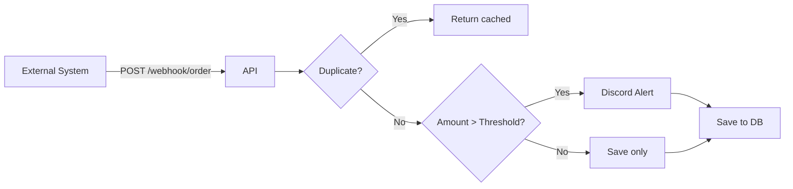

# Enterprise Webhook Automation Hub

[](https://github.com/Lucien0420/Enterprise-Webhook-Automation-Hub/actions/workflows/ci.yml)

**Repository:** [github.com/Lucien0420/Enterprise-Webhook-Automation-Hub](https://github.com/Lucien0420/Enterprise-Webhook-Automation-Hub)

**Traditional Chinese (繁體中文):** [README_zh-TW.md](./README_zh-TW.md)

## Overview

**Enterprise Webhook Automation Hub** is a lightweight webhook receiver for **order monitoring and automated alerts**.

### Core Features

- **Order Webhook Receiver**: External systems (e-commerce, ERP) push order data via `POST /webhook/order`
- **High-Value Alerts**: Sends Discord notification when order amount exceeds configurable threshold
- **API Key Authentication**: Protected by `X-API-KEY` header
- **SQLite Persistence**: Orders stored for query via `GET /orders`
- **Idempotency**: Same `order_id` processed once; no duplicate alerts
- **Rate Limiting**: Per-minute request cap to prevent abuse
- **Retry on Failure**: Discord send retries 3x with exponential backoff

### Use Cases

- E-commerce order monitoring
- High-value transaction alerts (fraud, large orders)
- Integration hub for multi-system webhooks

### Webhook Flow



### Design: Integration Hub & Extensibility

- **Multi-Source**: Receives webhooks from Shopify, Stripe, custom ERP, etc.
- **Custom Rules**: Trigger actions by amount, product, customer (extensible)
- **Multi-Output**: Discord is demo; architecture supports Slack, Email, internal APIs
- **Layered Structure**: config / schemas / services / api for easy extension

---

## Quick Start

### Option 1: Docker (Recommended)

```bash
# Ensure .env has API_KEY and DISCORD_WEBHOOK_URL
docker-compose up --build
```

Service runs at http://127.0.0.1:8000

### Option 2: Local

```bash
python -m venv .venv
.venv\Scripts\activate   # Windows
pip install -r requirements.txt
copy .env.example .env   # Edit API_KEY, DISCORD_WEBHOOK_URL
uvicorn main:app --reload
```

---

## Demo

### 1. Simulated Checkout (Interactive)

Open **http://127.0.0.1:8000/demo** after starting the service.

- Enter API Key (match `.env`)
- Fill order data, use amount presets or custom
- Submit → Discord receives alert when amount > 1000


### 2. Batch Demo Script

```bash
python scripts/demo_orders.py
```

Sends 8 sample orders (random order); Discord receives multiple alerts.


### 3. Query Orders Script

```bash
python scripts/query_orders.py
```

Prints order list (avoids PowerShell encoding issues).

### 4. API Docs

- Swagger UI: http://127.0.0.1:8000/docs
- ReDoc: http://127.0.0.1:8000/redoc

### 5. Unit Tests

```bash
pip install -r requirements.txt
pytest tests/ -v
```

### 6. Demo Video

**Demo video (YouTube):** [Watch on YouTube](https://youtu.be/X0hFKMLyuGg) — screen recording of `uvicorn main:app` with FastAPI Swagger UI authentication, automated Discord alerts triggered by `scripts/demo_orders.py`, and a peek at the SQLite database (`webhook_orders.db`) for idempotency verification.

---

## Environment Variables

| Variable | Description |
|----------|-------------|
| `API_KEY` | Secret key; must match `X-API-KEY` header |
| `DISCORD_WEBHOOK_URL` | Discord webhook URL (Channel → Edit → Integrations → Webhook) |
| `ALERT_THRESHOLD` | Alert threshold amount, default 1000 |
| `RATE_LIMIT_PER_MINUTE` | Max requests per minute, default 60 |
| `API_URL` | Demo scripts only, default `http://127.0.0.1:8000` |

---

## API Endpoints

| Method | Path | Description |
|--------|------|-------------|
| POST | `/webhook/order` | Receive order webhook (requires X-API-KEY) |
| GET | `/orders` | List orders (requires X-API-KEY) |
| GET | `/orders/{order_id}` | Get single order (requires X-API-KEY) |
| GET | `/health` | Health check (DB connectivity) |

---

## Project Structure

```
├── app/
│   ├── api/          # Webhook, order routes, shared deps
│   ├── core/         # Config, rate limiter
│   ├── db/           # Database, repository
│   ├── models/       # SQLAlchemy models
│   ├── schemas/      # Pydantic models
│   └── services/     # Discord notification
├── docs/             # Screenshots, demo video
├── static/           # Demo frontend
├── scripts/          # Demo scripts
├── main.py
├── Dockerfile
└── docker-compose.yml
```

---

## License

MIT License — see [LICENSE](LICENSE) for details.
