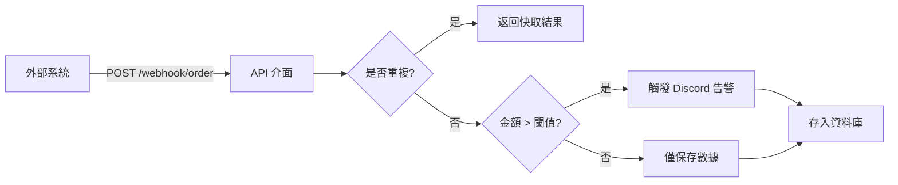
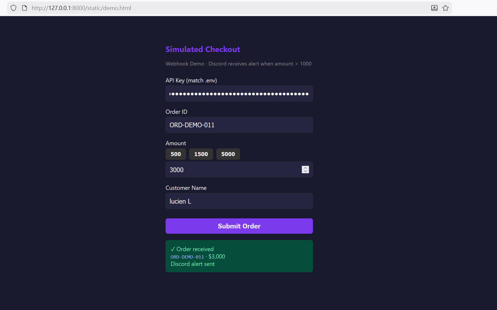
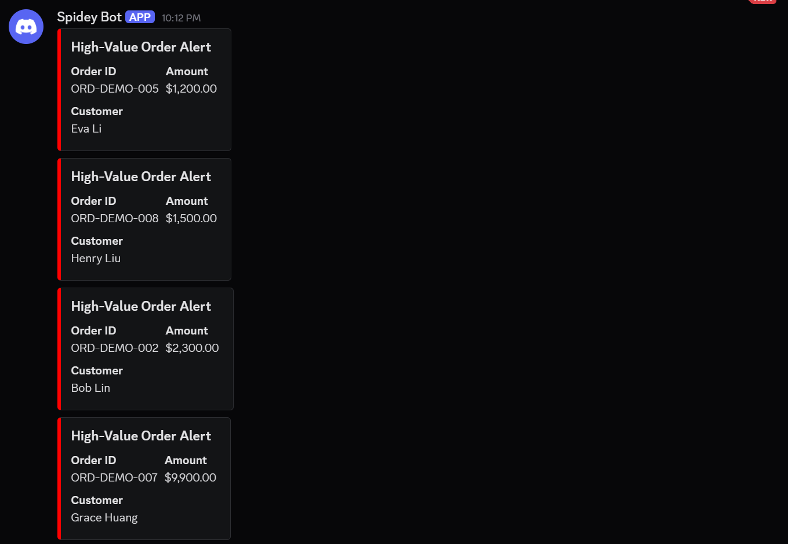

# 企業級 Webhook 自動化中心（繁體中文說明）

**語言：** [English](README.md) · **繁體中文**（本頁）

[](https://github.com/Lucien0420/Enterprise-Webhook-Automation-Hub/actions/workflows/ci.yml)

**程式庫：** [github.com/Lucien0420/Enterprise-Webhook-Automation-Hub](https://github.com/Lucien0420/Enterprise-Webhook-Automation-Hub)

## 專案概述

**Enterprise Webhook Automation Hub** 是一個輕量級且高效的 Webhook 接收器，專為**訂單監控與自動化告警**設計。本專案展示了如何構建一個具備安全性、可靠性與可擴展性的企業整合層，用於處理來自外部系統（如電子商務平台、ERP）的即時數據。

### 核心特性

- **訂單 Webhook 接收器**：提供標準 RESTful API (`POST /webhook/order`) 接收外部系統推送的訂單數據。
- **高額訂單即時告警**：當訂單金額超過設定閾值時，自動觸發 Discord 通知。
- **API 金鑰認證**：採用 `X-API-KEY` 標頭驗證，確保數據交換的安全性。
- **SQLite 持久化存儲**：所有接收到的訂單均存儲於資料庫中，並提供 `GET /orders` 介面進行查詢。
- **等冪性處理 (Idempotency)**：確保相同的 `order_id` 僅被處理一次，避免重複告警與數據冗餘。
- **速率限制 (Rate Limiting)**：內建每分鐘請求上限限制，防止惡意攻擊或系統過載。
- **失敗重試機制**：Discord 通知發送失敗時，具備 3 次指數退避 (Exponential Backoff) 重試機制，確保告警不漏接。

### 應用場景

- 電子商務訂單即時監控。
- 高額交易預警（防範詐欺、大額訂單追蹤）。
- 多系統 Webhook 整合中心（Integration Hub）。

### Webhook 處理流程



### 設計理念：整合中心與擴展性

- **多來源支援**：設計上可接收來自 Shopify, Stripe, 自有 ERP 等多種來源的 Webhook。
- **自定義規則引擎**：可根據金額、產品、客戶等條件觸發不同動作（具備高度擴展性）。
- **多管道輸出**：目前以 Discord 為例，架構上支持輕鬆擴展至 Slack、Email 或內部 API。
- **分層架構設計**：嚴格區分 `config` / `schemas` / `services` / `api` 層級，便於長期維護與功能擴充。

---

## 快速上手

### 選項 1：使用 Docker (推薦)

```bash
# 請確保 .env 檔案中已設定 API_KEY 與 DISCORD_WEBHOOK_URL
docker-compose up --build
```

服務將運行於：http://127.0.0.1:8000

### 選項 2：本地環境執行

```bash
python -m venv .venv
.venv\Scripts\activate   # Windows 環境
pip install -r requirements.txt
copy .env.example .env   # 編輯 API_KEY, DISCORD_WEBHOOK_URL
uvicorn main:app --reload
```

---

## 功能演示

### 1. 互動式模擬下單 (Demo Page)

啟動服務後，訪問 **http://127.0.0.1:8000/demo**。

- 輸入 API Key（需與 `.env` 一致）。
- 填寫訂單數據，可使用預設金額或自定義。
- 送出後，若金額 > 1000，Discord 將即時收到告警。



### 2. 批次處理演示腳本

```bash
python scripts/demo_orders.py
```

自動發送 8 筆測試訂單，模擬真實併發場景，觀察 Discord 告警觸發情況。



### 3. 訂單查詢腳本

```bash
python scripts/query_orders.py
```

列出資料庫中已存儲的訂單列表。

### 4. API 互動式文件

- Swagger UI: http://127.0.0.1:8000/docs
- ReDoc: http://127.0.0.1:8000/redoc

### 5. 單元測試

```bash
pytest tests/ -v
```

### 6. 演示影片

**Demo video (YouTube):** [點擊觀看](https://youtu.be/X0hFKMLyuGg) — 包含 FastAPI Swagger UI 認證流程、`scripts/demo_orders.py` 觸發的自動化告警，以及 SQLite 資料庫等冪性驗證演示。

---

## 環境變數設定

| 變數名稱 | 說明 |
|----------|-------------|
| `API_KEY` | 安全密鑰；需與請求頭 `X-API-KEY` 相符 |
| `DISCORD_WEBHOOK_URL` | Discord Webhook URL (頻道設定 → 整合 → Webhook) |
| `ALERT_THRESHOLD` | 告警金額閾值，預設為 1000 |
| `RATE_LIMIT_PER_MINUTE` | 每分鐘最大請求數，預設為 60 |
| `API_URL` | 演示腳本使用，預設為 `http://127.0.0.1:8000` |

---

## API 端點

| 方法 | 路徑 | 說明 |
|--------|------|-------------|
| POST | `/webhook/order` | 接收訂單 Webhook (需 X-API-KEY) |
| GET | `/orders` | 查詢訂單列表 (需 X-API-KEY) |
| GET | `/orders/{order_id}` | 查詢單筆訂單 (需 X-API-KEY) |
| GET | `/health` | 健康檢查 (資料庫連線狀態) |

---

## 專案結構

```
├── app/
│   ├── api/          # 路由定義 (Webhook, 訂單查詢)
│   ├── core/         # 全域設定、速率限制器
│   ├── db/           # 資料庫連線、Repository 模式實現
│   ├── models/       # SQLAlchemy 資料模型
│   ├── schemas/      # Pydantic 數據驗證模型
│   └── services/     # 業務邏輯 (Discord 通知服務)
├── docs/             # 截圖與文件資源
├── static/           # 前端 Demo 頁面
├── scripts/          # 演示與自動化腳本
├── main.py           # 程式入口
├── Dockerfile        # 容器化定義
└── docker-compose.yml # 容器編排
```

---

## 授權條款

MIT License — 詳見 [LICENSE](LICENSE) 檔案。
